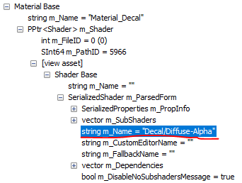
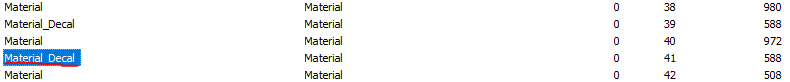
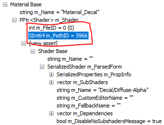
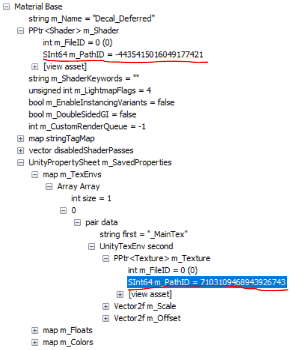
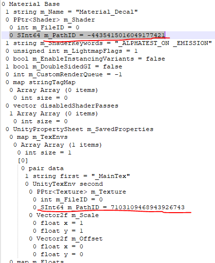
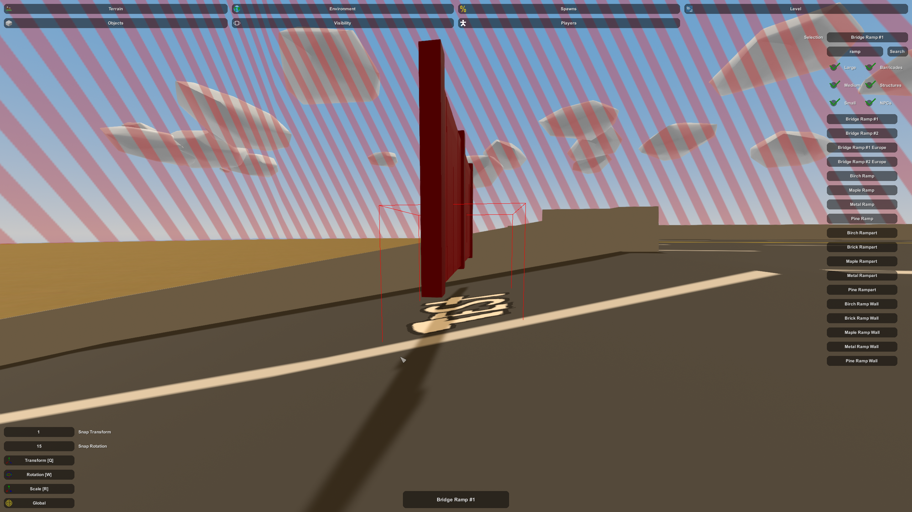

First setup an object as explained in the first half of the instructions, set the shader on the Decal_Deferred material to standard and set the texture to the one you want to use.
Export your finished setup to an asset bundle like you would normally.

Open UABE and open the file resources.assets in the Unturned/Unturned_Data directory
Click the Info button if nothing has happened yet
Navigate to View>Search By Name and inside of the prompt type Material_Decal
Open up the Data Inspector by clicking 'View Data'
Expand the tree Material Base>m_Shader>[view asset]>Shader Base>m_ParsedForm and look at the m_Name property. If your Decal uses an alpha channel then make sure this says Decal/Diffuse-Alpha

otherwise if you are not using an alpha channel look for the other object named Material_Decal right next to the one.

Once you have found the correct Material_Decal, copy down the Shader's m_PathID because you will need it again in a moment.

You can now exit out of the data inspection menu and while ensuring that the right Material_Decal is selected click 'Export Dump'. This will create a text file named something like "Material_Decal-resources.assets-39-Material.txt" in the directory of resources.assets
Navigate to View>Go To Asset and then in the File ID box ensure resources.asset is selected and the Path ID is the one for the shader that you copied down earlier; Click 'Ok'.
Then click 'Export Dump' again.
Lastly go to File>Close

Next open the asset bundle you exported from Unity in the beginning in UABE, it will prompt you to decompress the file and you should say yes, save it to a file with the same name but a different extension to make things easier.
Go to View>Search by Name and search for your material named "Decal_Deferred"
Open the data inspector
Find the shader m_PathID the same way you did the other one and copy that down, you do not need to export it
Now expand the tree m_SavedProperties>m_TexEnvs>Array>0>...>m_Texture and copy down that m_PathID as well

You are almost done (Yay!)
Now open up your dump file that has a similar name to "Material_Decal-resources.assets-39-Material.txt" and replace the Shader and _MainTex Path IDs with the ones you copied from your own asset bundle

Now go back to UABE
Find that shader with the Path ID inside of your asset bundle using View>Go to Asset again.
Click  'Import Dump' and open the dump generated by the Export Dump we did on the shader from resources.assets, the name should be similar to "unnamed asset-resources.assets-5923-Shader.txt"
Find your "Decal_Deferred" material again and then click 'Import Dump' and then import the Material_Decal dump you edited earlier

Lastly you just need to save the new Asset Bundle which is a little bit jankey so I recommend doing all of the following:
On the current window click File>Save then File>Close and then on the next window do File>Save then File>Close again.
You can now use the uncompressed asset bundle you saved with a different extension as you would normally and any decals will render correctly!

Now you can have decals in places never once thought possible! Unlimited Power!
